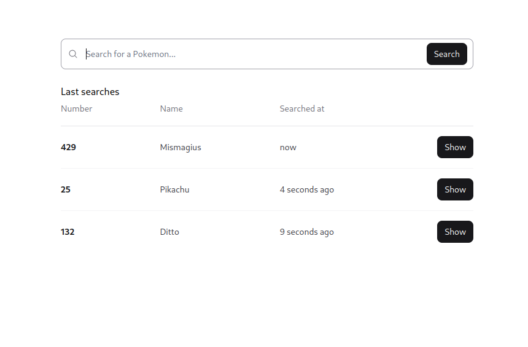
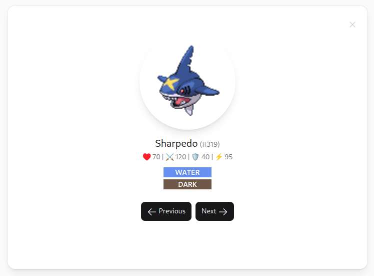

# 🔥 Pokedex

> [!NOTE]
> This project was done as part of the coding challenge for the Apprenticeship program at [Subvisual](https://subvisual.com/).

## 📌 Description

This project is a simple Pokedex that allows users to search for a Pokemon by its name or number and see its details.

It was built using [Phoenix](https://www.phoenixframework.org/) and [LiveView](https://hexdocs.pm/phoenix_live_view/Phoenix.LiveView.html).

## 🔧 Setup

First, clone the repository:

```
git clone git@github.com:ruilopesm/pokedex.git
cd pokedex
git checkout main
```

Then, run the setup script to get all dependencies configured.

```
bin/setup
```

## 🔨 Development

Start the development server and then you can visit `http://localhost:4000` from your browser.

```
bin/server
```

## ✨ Gallery




## 📝 Notes

### Frontend

The frontend follows a simple structure with a single page that contains a search bar and a list of the last searched Pokemons.

I've almost always make use of components that ship with Phoenix LiveView - one can find them at `lib/pokedex_web/components/core_components.ex`[^1] file.
Using such components allowed me not only to have a cleaner codebase, but also to be more productive.

[^1]: Some components needed little tweaks to fit the project's needs.

### PokeAPI

In order to fetch the Pokemon data, I've used the [PokeAPI](https://pokeapi.co/). With it, I was able to fetch the Pokemon's name, number, hp, attack, defense, speed,
type(s) and sprite(s).

Inside `lib/pokedex/models` directory, one can find the `pokemon.ex` file, which contains a `Pokemon` struct that represents the Pokemon data fetched from the API after a bit of processing.

Talking about processing, I've created a `PokeAPI` service inside `lib/pokedex/services` directory that is responsible for fetching the Pokemon data from the API and processing it. Exposing a single function `get_pokemon/1` that receives the Pokemon's name or number and returns a `Pokemon` struct (or an error).

I like to follow this pattern where I have services that are responsible for doing something specific, only exposing necessary functions to the outside world.

### Search Feature

For simplicity, the exactly requested search feature, where inputting a Pokemon's name or partial name should look for a matching one and show it, was not implemented.

Instead, I've opted to only show a Pokemon's details when the user submits the search form, not allowing partial searches.

### Last Searches

After a user searches for a Pokemon, the Pokemon's details are shown and the Pokemon is added to the list of last searches. This list is displayed as a table below the search bar.

Said list is stored inside the LiveView's assigns, so it's not persisted between page reloads.

### Pokemon Details

The details of a Pokemon are shown inside a modal. This modal can be triggered/opened by searching for a Pokemon or clicking on a Pokemon's entry in the last searches list.

Inside the modal, one can see the Pokemon's name, number, hp, attack, defense, speed, type(s) and front-face sprite. There also two buttons that allow the user to get the previous or next Pokemon in the pokedex. These buttons are only enabled if there is a previous or next Pokemon, respectively, and also make use of the cache system[^4].

[^4]: Explained in the next section.

### Cache System

A caching system was implemented to avoid making the same request to the PokeAPI multiple times for the same Pokemon.

There are a couple ways to implement a cache system in Elixir.
- Using ETS tables
- Using a GenServer
- Using a library like `cachex` or `nebulex`

I've opted to use [Nebulex](https://github.com/cabol/nebulex) for this project. I really liked the Python's decorator-like API that it provides.

By default, the cache system has a TTL of 1 hour, but this can be easily changed by modifying the `Pokedex.Cache` entry in the `config/config.exs` file.

### Testing

I've created some tests for the `PokeAPI` module. They can be found at `test/pokedex/services/poke_api_test.exs`.

I've also make use of the `doctest` macro provided by [ExUnit](https://hexdocs.pm/ex_unit/ExUnit.DocTest.html) to run the examples in the `ViewUtils`[^2] module.

[^2]: This module was created with the purpose of having some utility functions that might be used throughout views. One example is the `relative_datetime/1` function that receives a `DateTime` struct and returns a string representing the relative time from now.

### Faced Issues

The main issue I've encountered was related to the modal provided by Phoenix LiveView. For some reason, I was not able to open it again after closing it once. I've tried to debug it, but I was not able to find the root cause of the issue. Actually, I've found someone with a similar issue [here](https://elixirforum.com/t/modal-conflicts-with-js-when-closed/55014).

Anyway, I've solved the problem by adding a function callback to `on_cancel` modal's attribute that resets the modal's state. This function call is pushed from the client to the server, thus, the modal's state is tracked inside the LiveView [^3].

[^3]: This is not the best solution, but it was the one that I've found to work. The best solution would be to have all of this working on the client-side.

### What I've Learned

I've never used a cache system before, so it was a nice opportunity to learn how to use one - it was proven to be quite simple with Nebulex. In the future, I would love to implement one all by myself using, for example, ETS tables.

### Future Improvements

Make the search feature more flexible, allowing partial searches.

Persist the last searches list between page reloads (and even server restarts), by using a tiny database like SQLite.

Fix the modal issue, by having it working on the client-side.

Make the cache system more smart, by having it not fetching the same Pokemon by name and number. Meaning, if a Pokemon was fetched by name, it should not fetch it again by number.

Make it possible to see more details about a Pokemon, like its abilities, moves, etc. An image slider (since a Pokemon usually has more than one sprite) and a shiny toggle would both be nice features to have as well.

### Deployment

I took the liberty to deploy the project to [Fly.io](https://fly.io/). One can access it [here](https://pokedex.ruilopesm.com/).
